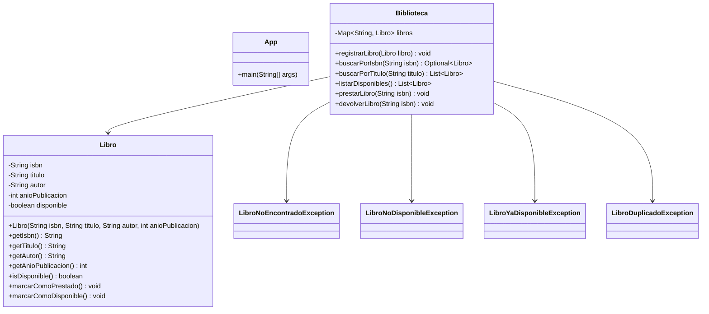

# Sistema de Biblioteca

Aplicación Java orientada a objetos para gestionar una biblioteca en memoria. El sistema permite registrar libros, buscarlos por ISBN o título, listar los disponibles, prestar libros y devolverlos.

El proyecto está preparado para trabajo con Maven y pruebas automatizadas con JUnit 5. La persistencia es completamente en memoria usando colecciones Java, sin base de datos ni frameworks adicionales.

## UML sencillo



## Cómo ejecutar

### Windows 

Desde la carpeta raíz del repositorio:

```
cd .\biblioteca-tdd\
.\mvnw.cmd test
```

### Linux / Mac

```bash
./mvnw test
```

> En Windows, el comando debe ejecutarse dentro de la carpeta `biblioteca-tdd`.

## Tecnologías

- Java 21
- Maven
- JUnit 5
- Maven Wrapper
- Colecciones Java en memoria

## TDD

El proyecto está pensado para seguir el ciclo TDD:

1. Red: escribir una prueba que falle.
2. Green: implementar lo mínimo para que pase.
3. Refactor: mejorar el diseño sin romper el comportamiento.

En este caso, el dominio de biblioteca está separado en modelo, servicio y excepciones para facilitar pruebas unitarias claras sobre cada regla de negocio.

## Cobertura

La cobertura de pruebas debe centrarse en los comportamientos del dominio:

- registro de libros
- búsqueda por ISBN
- búsqueda parcial por título
- listado de disponibles
- préstamo de libros
- devolución de libros
- validación de errores y excepciones

Actualmente el proyecto incluye un test base mínimo en [AppTest.java](src/test/java/cl/usm/biblioteca/AppTest.java), por lo que la cobertura funcional real todavía es baja. La estructura ya está lista para ampliar la suite de pruebas con casos de negocio.

## Estructura del proyecto

```text
biblioteca-tdd/
├── pom.xml
├── mvnw
├── mvnw.cmd
├── .mvn/
│   └── wrapper/
│       ├── maven-wrapper.jar
│       └── maven-wrapper.properties
├── src/
│   ├── main/
│   │   └── java/
│   │       └── cl/usm/biblioteca/
│   │           ├── App.java
│   │           ├── exception/
│   │           │   ├── LibroDuplicadoException.java
│   │           │   ├── LibroNoDisponibleException.java
│   │           │   ├── LibroNoEncontradoException.java
│   │           │   └── LibroYaDisponibleException.java
│   │           ├── model/
│   │           │   └── Libro.java
│   │           └── service/
│   │               └── Biblioteca.java
│   └── test/
│       └── java/
│           └── cl/usm/biblioteca/
│               └── AppTest.java
└── target/
```

## Notas del diseño

- `Libro` modela el estado del libro y su disponibilidad.
- `Biblioteca` concentra la lógica de negocio y la persistencia en memoria.
- Las excepciones personalizadas representan errores de dominio específicos.
- `Optional` se usa para búsquedas seguras por ISBN.
- `Map` se usa para acceso rápido por clave única.
